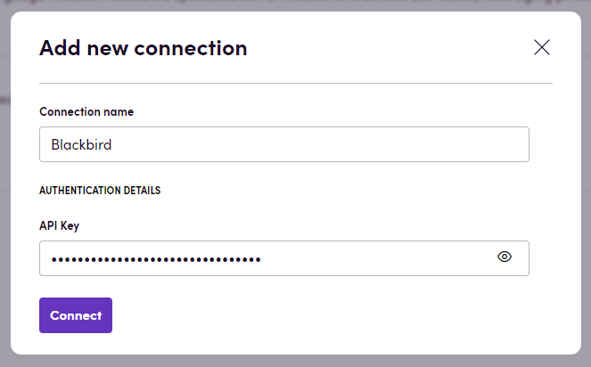
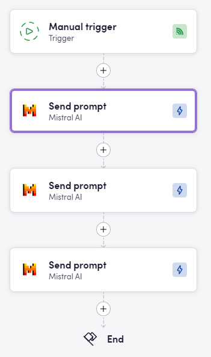
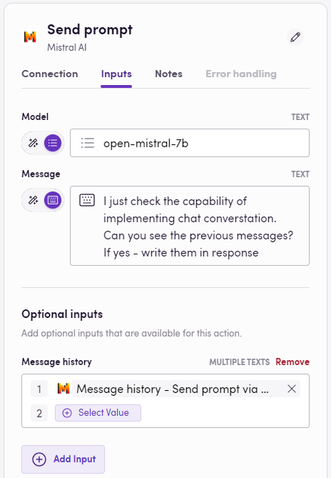
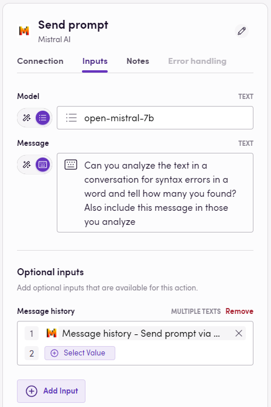

# Blackbird.io Mistral AI

Blackbird is the new automation backbone for the language technology industry. Blackbird provides enterprise-scale automation and orchestration with a simple no-code/low-code platform. Blackbird enables ambitious organizations to identify, vet, and automate as many processes as possible. Not just localization workflows, but any business and IT process. This repository represents an application that is deployable on Blackbird and usable inside the workflow editor.

## Introduction

<!-- begin docs -->

Fast, open-source and secure language models. Facilitated specialisation of models on business use-cases, leveraging private data and usage feedback.

## Before setting up

Before you can connect you need to make sure that:

- You must [have access to the Mistral AI console](https://console.mistral.ai/).
- Create your [API key](https://console.mistral.ai/api-keys/).
- Save this key for future use.

You can view a [complete guide](https://docs.mindmac.app/how-to.../add-api-key/create-mistral-ai-api-key) about creating the Mistral AI API Key with the registration process.

## Connecting 

1. Navigate to apps and search for Mistral. If you cannot find Mistral, then click _Add App_ in the top right corner, select Contentstack, and add the app to your Blackbird environment.
2. Click _Add Connection_.
3. Name your connection for future reference, e.g., 'My client'.
4. In the _API Key_ field, input your API Key. You can get it from [here](https://console.mistral.ai/api-keys/).
5. Click _Connect_.
6. Confirm that the connection has appeared and the status is _Connected_.

## Actions

### Chat

- **Send prompt**: This action allows you to send a prompt to an AI model and receive its response. When you submit your message, it's processed and sent to the AI through our system. The AI then generates a response based on your input. If you've had a conversation history, it will be preserved and included along with the new AI response in the returned details

### XLIFF

All XLIFF actions supports 1.2 and 2.1 versions of the XLIFF format, since these are the most common versions used in the industry, but if you need support for other versions, please reach out to us and we will consider adding support for them.

- **Get Quality Scores for XLIFF file** Gets segment and file level quality scores for XLIFF files. Optionally, you can add Threshold, New Target State and Condition input parameters to the Blackbird action to change the target state value of segments meeting the desired criteria (all three must be filled).

  Optional inputs:
    - Prompt: Add your criteria for scoring each source-target pair. If none are provided, this is replaced by _"accuracy, fluency, consistency, style, grammar and spelling"_.
    - Bucket size: Amount of translation units to process in the same request. (See dedicated section)
    - Threshold: value between 0-10.
    - Condition: Criteria to filter segments whose target state will be modified.
    - New Target State: value to update target state to for filtered translation units.

  Output:
    - Average Score: aggregated score of all segment level scores.
    - Updated XLIFF file: segment level score added to extradata attribute & updated target state when instructed.

- **Post-edit XLIFF file** Updates the targets of XLIFF files

Optional inputs:
- Prompt: Add your linguistic criteria for postediting targets.
- Bucket size: Amount of translation units to process in the same request. (See dedicated section)
- Glossary
- Add missing trailing tags: If true, missing trailing tags will be added to the target segment.

> The Prompt used in this actions is "Your input consists of sentences in `source` language with their translations into `target language`. Review and edit the translated target text as necessary to ensure it is a correct and accurate translation of the source text. If you encounter XML tags in the source also include them in the target text, don't delete or modify them." By using the "Prompt" optional input, your instructions will be appended to the prompt.

- **Process XLIFF file** given an XLIFF file, processes each translation unit according to provided instructions in the optional input "Prompt" (if no Prompt is provided, the source texts will be translated) and updates the target text for each unit.

> Whenever a Glossary is added as optional input for any of the above described actions, the Prompt used is "Enhance the target text by incorporating relevant terms from our glossary where applicable. Ensure that the translation aligns with the glossary entries for the respective languages. If a term has variations or synonyms, consider them and choose the most appropriate translation to maintain consistency and precision."

## Example

Using our application you can build the following bird:

First action:

Second action:

Third action:

As you can see, you can specify a message history to maintain the context of the conversation

## Feedback

Do you want to use this app or do you have feedback on our implementation? Reach out to us using the [established channels](https://www.blackbird.io/) or create an issue.

<!-- end docs -->
